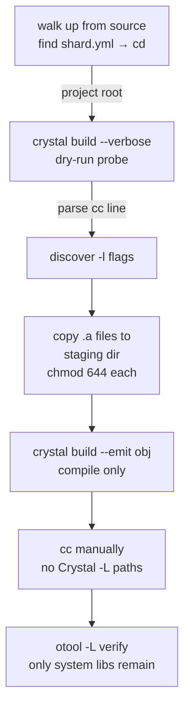

# Static Linking on macOS with Crystal

This document explains why static linking Crystal binaries on macOS is
non-trivial, what we tried, what failed, and how `crystal-macos-static-build`
solves it.

## Background

On Linux (particularly Alpine), producing a self-contained Crystal binary is
straightforward:

```sh
shards build --release --static
```

Alpine uses musl libc, which supports full static linking. The result is a
single binary with zero runtime dependencies.

On macOS, `--static` fails outright:

```
ld: library 'crt0.o' not found
```

Apple's linker does not ship `crt0.o` — the C runtime startup object that
fully static executables require. Full static linking of executables is simply
not supported on macOS. Only `libSystem.B.dylib` (Apple's unified kernel
interface — libc, pthreads, mmap, etc.) is permitted to remain dynamic, and
even that is non-negotiable.

The goal then is **partial static linking**: bake in all third-party libraries
as static archives (`.a`), leaving only Apple's own system libraries dynamic.

## The dependency landscape

A Crystal binary links against several native C libraries. On macOS with
Homebrew these are:

|Library               |Purpose                             |Homebrew formula      |
|----------------------|------------------------------------|----------------------|
|`libgc`               |Boehm garbage collector             |`bdw-gc`              |
|`libpcre2`            |Regular expressions                 |`pcre2`               |
|`libevent`            |Async I/O                           |`libevent`            |
|`libssl` / `libcrypto`|TLS                                 |`openssl@3`           |
|`libxml2`             |XML parsing (Crystal stdlib)        |`libxml2`             |
|`libyaml`             |YAML parsing (Crystal stdlib)       |`libyaml`             |
|`libsqlite3`          |SQLite (via `crystal-sqlite3` shard)|`sqlite`              |
|`libiconv`            |Character encoding                  |Apple system library ✓|
|`libSystem`           |Apple kernel interface              |Apple system library ✓|

`libiconv` and `libSystem` come from `/usr/lib` — Apple's own copies, present
on every macOS installation, living in the dyld shared cache. These are safe
and correct to leave dynamic. Everything above them in the table is what we
want to bake in.

Homebrew provides `.a` static archives alongside `.dylib` shared libraries for
all of these. The problem is getting the linker to use the `.a` instead of the
`.dylib`.

## What we tried

### Attempt 1 — Pass `.a` paths via `--link-flags`

```sh
shards build --release \
  --link-flags="$BREW/lib/libgc.a \
                $BREW/lib/libpcre2-8.a"
```

**Result:** `otool -L` still showed the `.dylib` versions. The `.a` paths were
passed to the linker but lost to Crystal's own `-lgc` flag which resolved the
`.dylib` from Crystal's hardcoded `-L<cellar>` path.

### Attempt 2 — `-force_load`

```sh
shards build --release \
  --link-flags="-force_load $BREW/lib/libgc.a"
```

`-force_load` tells the linker to load all symbols from an archive regardless
of whether they are referenced. **Result:** no change. The dylib reference
persisted.

### Attempt 3 — Staging directory with only `.a` files

Since macOS `ld` prefers `.dylib` over `.a` when both exist in a search path,
we copied only the `.a` files into a clean temp directory and put it first:

```sh
mkdir /tmp/static-libs
cp $BREW/lib/libgc.a /tmp/static-libs/

shards build --release \
  --link-flags="-L/tmp/static-libs"
```

**Result:** still the `.dylib`. The verbose link command revealed why:

```
cc _main.o3.o -o sandboxer
  -L/tmp/static-libs -lgc          ← our flag
  ...
  -L/opt/homebrew/Cellar/bdw-gc/8.2.12/lib -lgc   ← Crystal adds this
ld: warning: ignoring duplicate libraries: '-lgc'
```

Crystal hardcodes `-L<cellar-path>` for every dependency it knows about.
`ld` deduplicated the `-lgc` flag but still recorded the dylib's install name
into the binary's load commands when it encountered the `.dylib` in the Cellar
path — even though the `.a` was supposedly resolving the symbols.

### Attempt 4 — Confirm via `install_name_tool`

To verify the dylib reference was genuine (not a phantom), we rewrote it to a
non-existent path:

```sh
install_name_tool -change \
  /opt/homebrew/opt/bdw-gc/lib/libgc.1.dylib \
  /nonexistent \
  bin/release/sandboxer
```

Running the binary crashed with `dyld: Library not loaded: /nonexistent`.
The dylib was genuinely required at runtime — the `.a` was not being used for
symbol resolution.

### Attempt 5 — `-Wl,-no_implicit_dylibs` and `LDFLAGS`

Various combinations of `-Wl,-no_implicit_dylibs`, `LDFLAGS`, and
`CRYSTAL_OPTS` were tried. None could override Crystal's hardcoded
`-L<cellar>` paths. The flags reached the linker but came too late — Crystal's
paths were already in the command.

### Diagnosis — inspecting the `.a`

To rule out the `.a` itself being the source of the dylib reference:

```sh
otool -L $BREW/lib/libgc.a        # no dylib references
otool -l $BREW/lib/libgc.a | grep DYLIB  # nothing
```

The Homebrew `.a` is a clean static archive. The problem is entirely in how
Crystal constructs the link command.

## Root cause

Crystal's compiler, when generating the link command, hardcodes
`-L/opt/homebrew/Cellar/<formula>/<version>/lib` for every dependency it knows
about, followed by `-l<name>`. This happens unconditionally — there is no flag
or environment variable to suppress it.

macOS `ld` prefers `.dylib` over `.a` when both are reachable from any `-L`
path in the command, regardless of ordering. Since Homebrew places `.a` and
`.dylib` side by side in every Cellar directory, and Crystal injects the Cellar
path, the linker always finds and prefers the `.dylib`.

```
Crystal's link command (simplified):
  cc main.o
    -L/tmp/static-libs -lgc        ← our attempt to force .a
    -L/opt/homebrew/Cellar/bdw-gc/8.2.12/lib -lgc   ← Crystal's addition
                                                          ↑
                                              .dylib wins from here
```

No `--link-flags` trick can prevent Crystal from appending its own `-L` paths.

## The solution — separate compilation from linking

Crystal's `--emit obj` flag compiles the source to an object file without
linking. This lets us invoke the linker ourselves with full control — no
Crystal-injected paths.

```sh
# Step 1: compile to object file
crystal build src/myapp.cr --release --emit obj -o /tmp/myapp

# Step 2: link with only a static-only staging directory in the search path
STATIC_DIR=$(mktemp -d)
cp $BREW/lib/libgc.a      $STATIC_DIR/
cp $BREW/lib/libpcre2-8.a $STATIC_DIR/

cc /tmp/myapp.o -o bin/release/myapp \
  -L$STATIC_DIR \
  -lgc -lpcre2-8 -liconv \
  -rdynamic
```

With no `.dylib` files in `$STATIC_DIR`, `-lgc` can only resolve to `libgc.a`.
Crystal's hardcoded Cellar paths are never involved.

**Verification:**

```sh
otool -L bin/release/myapp
# bin/release/myapp:
#   /usr/lib/libiconv.2.dylib
#   /usr/lib/libSystem.B.dylib
```

Only Apple's system libraries remain.

### Discovering which `-l` flags to pass

The set of libraries Crystal links varies by project and Crystal version. Rather
than hardcoding them, we discover them by running a verbose dry-run first:

```sh
crystal build src/myapp.cr --release --emit obj --verbose 2>&1 | grep '^cc '
# cc _main.o3.o -o /tmp/_probe -rdynamic
#   -L/.../bdw-gc/8.2.12/lib -lgc
#   -L/.../pcre2/10.47_1/lib -lpcre2-8
#   -liconv
```

This gives us exactly the `-l` flags Crystal would have used, which we then
redirect to our static-only staging directory.

### keg-only Homebrew formulae

Some Homebrew formulae are **keg-only** — not symlinked into `$(brew --prefix)/lib`
to avoid conflicting with Apple's own copies. Their `.a` files live under
`$(brew --prefix)/opt/<name>/lib/` instead:

|Library              |Path                                 |
|---------------------|-------------------------------------|
|`libssl`, `libcrypto`|`$(brew --prefix)/opt/openssl@3/lib/`|
|`libxml2`            |`$(brew --prefix)/opt/libxml2/lib/`  |
|`libsqlite3`         |`$(brew --prefix)/opt/sqlite/lib/`   |

`crystal-macos-static-build` knows about these locations and searches them
automatically.

Keg-only `.a` files are installed read-only by Homebrew (`-r--r--r--`). The
script `chmod 644`s each file after copying it into the staging directory, so
the linker can read and process them correctly.

## `crystal-macos-static-build`

The script in `bin/crystal-macos-static-build` automates the full process:

```
crystal-macos-static-build src/myapp.cr -o bin/release/myapp --release
```



The script automatically walks up from the source file to find `shard.yml`
and changes into that directory before building, so it works correctly
regardless of the caller's working directory.

If your project bakes in assets at compile time (e.g. via `baked_file_system`),
those assets must exist before the script runs — the dry-run probe compiles
the source and will fail if referenced paths are missing. Run any asset
generation (web UI build, etc.) before invoking the script.

See the script's `--help` output and inline comments for full usage.

## Why this doesn't apply to Linux

On Alpine Linux, `--static` works because:

- musl libc supports fully static executables
- Alpine packages provide proper standalone `.a` files
- There is no linker preference for `.dylib` (Linux uses `.so`, and `-static`
  suppresses all shared library resolution)

On standard glibc Linux distros (Ubuntu, Debian, etc.), partial static linking
has similar challenges to macOS — but the recommended approach there is to use
an Alpine Docker container for release builds rather than fighting the system
linker.
